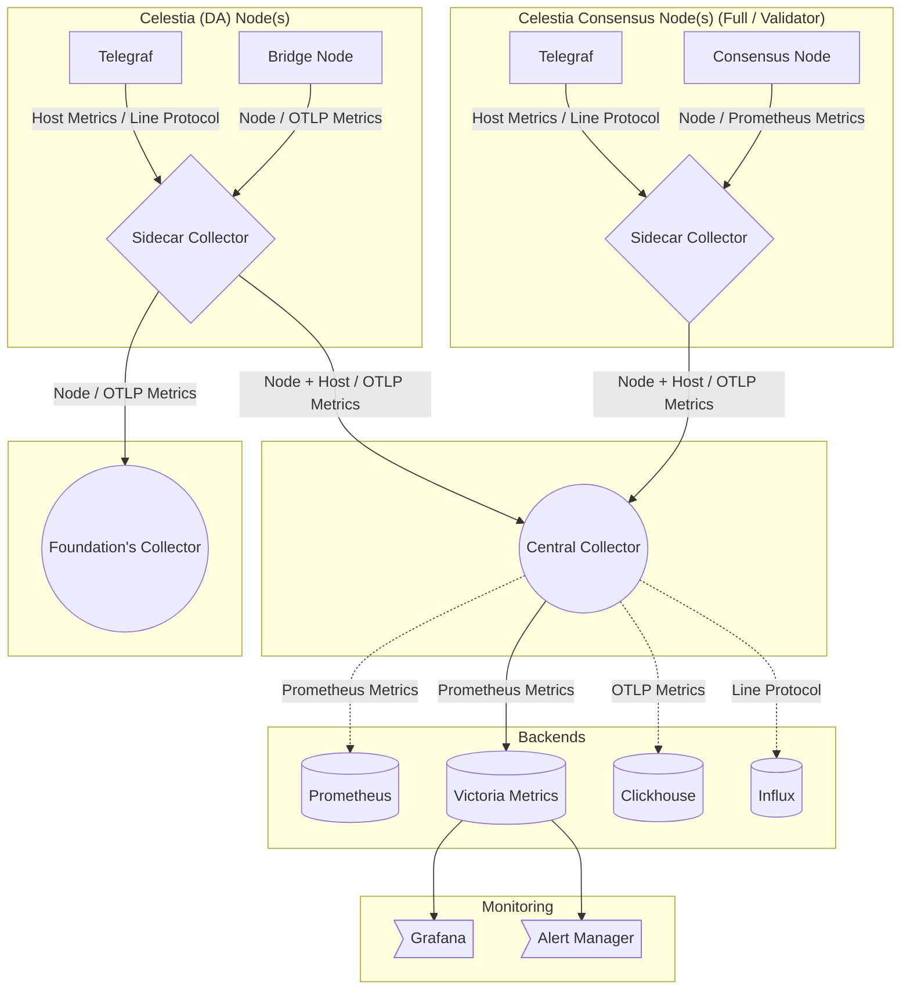

# celestia-da-monitoring
Repo related to node monitoring setups.
# Architecture

## A Bird's Eye View

## High-Level Components

### OpenTelemetry Collector
- Streamlines the collection and delivery of metrics.

### Telegraf Agent
- Collect's host-level metrics and run additional scripts to derive specific metrics.

### Sidecar Collector
- Run's the OpenTelemetry collector on the same machine as the node.

### Central Collector
- Handle's the aggregation of metrics from multiple sidecar collectors.
- Ideally deployed behind a load balancer to distribute the load and for HA.

## Protocols

### OTLP (OpenTelemetry Protocol)
- Native protocol for OpenTelemetry metrics.

### Line Protocol
- Native protocol for Telegraf Agent, also used by InfluxDB.

### Prometheus Format
- Standard protocol for Prometheus metrics.
- Metrics are typically exposed via the `/metrics` endpoint
