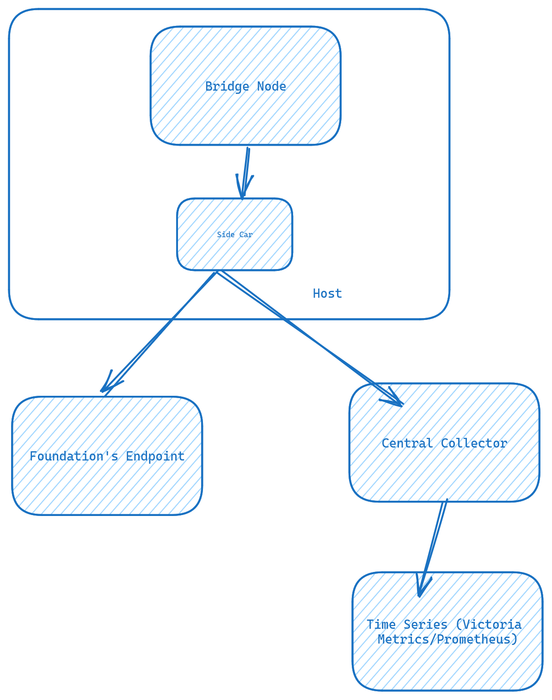

# Pattern 3


## Setup
[Collector Setup Guide](../../../base/collector.md)

### [Reference](https://docs-celestia.chaintrails.io/monitoring/nodes/bridge-node/pattern-3.html)

## Verification
```bash
curl -s '$vm_ip:$vm_port/api/v1/series'   --data-urlencode 'match[]={job="mocha-4/Bridge"}'   --data-urlencode "start=$(date -d '30 minutes ago' +%s)" |   jq -r '.data[].__name__' |   sort -u
```
- Replace `vm_ip` with the `victoria metrics` host `ip`.
```bash
core_ex_get_by_height_request_time_bucket
core_ex_get_by_height_request_time_count
core_ex_get_by_height_request_time_sum
core_listener_last_time_subscription_stuck_timestamp
eds_blockstore_cache_blockstore_evicted_counter_total
eds_blockstore_cache_blockstore_get_counter_total
eds_blockstore_cache_blockstore_size
eds_blockstore_cache_recent_evicted_counter_total
eds_blockstore_cache_recent_get_counter_total
eds_blockstore_cache_recent_size