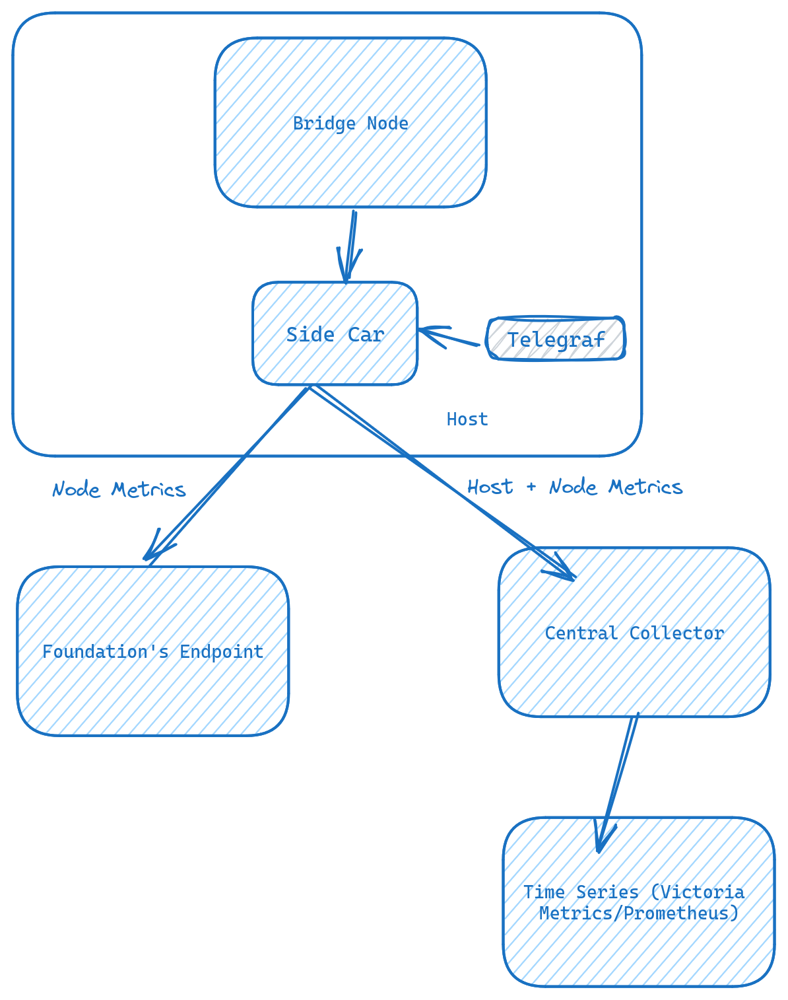

# Pattern 4


## Setup
[Collector Setup Guide](../../../base/collector.md)

[Telegraf Setup Guide](../../../base/telegraf.md)

### [Reference](https://docs-celestia.chaintrails.io/monitoring/nodes/bridge-node/pattern-4.html)

## Verification
```

curl -s '$vm_ip:$vm_port/api/v1/series'   --data-urlencode 'match[]={host=$hostname}'   --data-urlencode "start=$(date -d '30 minutes ago' +%s)" |   jq -r '.data[].__name__' |   sort -u

    Replace vm_ip, vm_port with victoria metrics host & ip.
    Replace $hostname, with sidecar host.
```
```bash

cpu_usage_guest
cpu_usage_guest_nice
cpu_usage_idle
cpu_usage_iowait
cpu_usage_irq
cpu_usage_nice
cpu_usage_softirq
cpu_usage_steal
cpu_usage_system
cpu_usage_user
disk_free
disk_inodes_free
disk_inodes_total
```